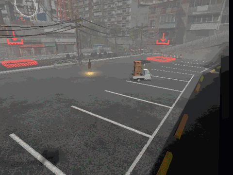

# gd-CCTV
<strong>A Godot Plugin for building custom & intelligent camera systems that tracks a certain target

***The demo above is made with the game [vitvitDRIVER 3D](https://store.steampowered.com/app/4248230/vitvitDRIVER_3D) by [@vicpoire](https://x.com/vicpware)***

# How to use
1. Install the plugin and add it to your project
2. Create a CCTVManager node in your scene
3. Add CCTVCamera nodes across your scene
5. Set all the created CCTVCamera nodes in the CCTVManager's `cameras` array
6. Set the `target` variable in the CCTVManager to the node you want the cameras
7. Customize the cameras as you wish! You can change when they "see" the target (VisionTester) and change how they behave and move (CameraBehaviour)
